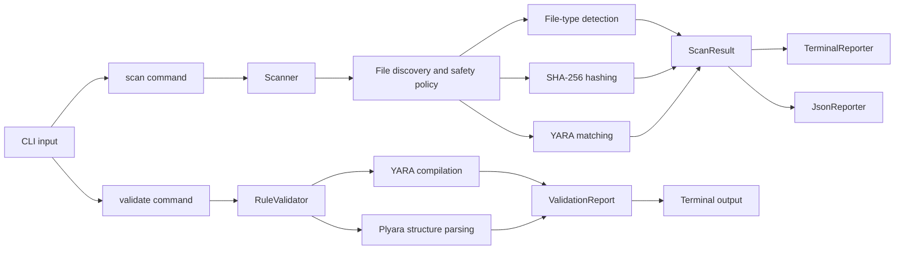

# Architecture

YARA Scout separates command handling, scanning, result representation, and
presentation. The YARA engine compiles and evaluates rules; YARA Scout coordinates
the surrounding triage workflow.

## Data flow

The scanner compiles the selected rule collection once. Its `scan()` method then
yields one `ScanResult` for each discovered file. Terminal reporting consumes
those results as they arrive. When JSON output is requested, the CLI retains the
same streamed results and writes the complete report afterward.

The validator checks each rule with the same YARA engine used for scanning, then
uses Plyara to inspect rule names, tags, and metadata. It returns all objective
convention findings together rather than stopping after the first invalid file.

## Components

### CLI

`cli.py` owns Typer arguments, scanner construction, reporter coordination, and
process exit codes. It does not perform hashing, file-type detection, or YARA
matching.

### Scanner

`scanner.py` owns:

- rule-file discovery and compilation;
- target-file discovery;
- timeout, size, and symbolic-link policy;
- SHA-256 hashing;
- calls into `yara-python`; and
- normalization of raw YARA matches.

The `Scanner` instance retains compiled rules and safety settings. Scan results
are yielded rather than accumulated inside the scanner.

### Validator

`validation.py` owns rule discovery, authoritative compilation through
`yara-python`, structural parsing through Plyara, and objective convention
checks. `ValidationReport` and `ValidationFinding` keep that logic independent
from terminal formatting.

Compilation and parsing are intentionally separate. A rule must compile before
its convention is inspected, and parser compatibility failures are reported
separately from YARA syntax failures.

### File-type detector

`filetypes.py` checks known signatures for PE, ELF, PDF, ZIP, PNG, JPEG, and
GZIP. When no signature matches, it consults Python's MIME extension mapping and
finally falls back to `application/octet-stream`.

This classification is triage metadata, not a file-validity guarantee.

### Models

`models.py` defines the data exchanged between components:

- `FileType` records a MIME value and detection source.
- `RuleMatch` normalizes a YARA rule, namespace, tags, and metadata.
- `ScanResult` represents the outcome for one discovered path.

### Reporters

`TerminalReporter` streams human-readable findings through a Rich console and
returns aggregate counts. `JsonReporter` serializes the same models into a
versioned envelope and applies path redaction.

## Result states

Each result is interpreted as exactly one of four states:

| State | Meaning |
| --- | --- |
| `matched` | The file was scanned and one or more rules matched. |
| `clean` | The file was scanned and no rules matched. |
| `error` | Reading, hashing, or YARA evaluation failed for the file. |
| `skipped` | Scanner policy excluded the file before YARA evaluation. |

Reporters apply the precedence `skipped → error → matched → clean` when mapping
a result to a status.

## Failure boundaries

Invalid configuration, unavailable rule paths, compilation failures, and target
discovery failures prevent the operation from completing. Individual file
failures are recorded and scanning continues with the next discovered file.
Policy skips are expected outcomes rather than failures.

Validation startup failures return immediately. Once validation begins,
compilation and convention findings are collected across the discovered rule
files and produce validation exit code `1`.

The resulting process codes are documented in the
[README command reference](../README.md#command-reference).
